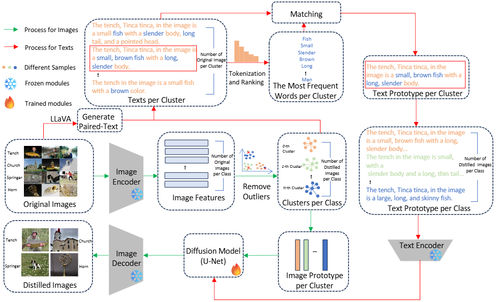
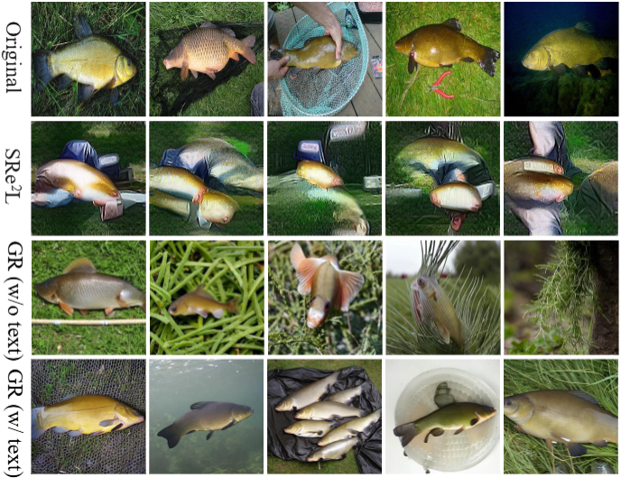

# Dataset Distillation via Vision-Language Category Prototype

## ✨ Stellar Features
- 🔥 First to incorporate language information into visual dataset distillation (DD), enhancing image features such as shape, color, and background through textual descriptions
- 🧠 Leverages open-source large language models to generate textual descriptions, improving generalization and addressing the lack of text in DD benchmarks.
- 📝 Introduces a text prototype scheme, using word frequency to enhance representativeness and diversity..
- 🎯 The distilled datasets are high-quality and versatile.

## 📖 Introduction
Existing diffusion-based dataset distillation (DD) methods face challenges such as missing target objects, unrealistic outputs, and co-occurrence bias due to their reliance on visual features alone. To address these issues, we propose a vision-language framework that integrates textual descriptions into DD.
By combining text and image prototypes, our approach enhances dataset quality, producing logically coherent and semantically enriched images. Experimental results show state-of-the-art performance, with significant accuracy improvements on various benchmarks.



## 🚀 Quick Start

### Create environment
```sh
# Requirements
Python >= 3.12.4
PyTorch >= 2.3.1
Torchvision >= 0.18.1
diffusers >= 0.30.0.dev0
llava >= 1.2.2.post1
```
#### Generate text via LLava
You can install or upgrade the latest version of [LLava GitHub Repository](https://github.com/LLava).
```sh
#Generate configure for llava
python 01_text_generation/config_produce_llava.py
# Run llava
python LLaVA/llava/eval/model_vqa.py     --model-path liuhaotian/llava-v1.5-7b     --question-file     output.json      --image-folder    ImageNette/train     --answers-file   answer-file-our.jsonl
#Arrange the file format
python 01_text_generation/llava_result_sum
```
### Diffusion model training
You can install or upgrade the latest version of [Diffusers library](https://github.com/huggingface/diffusers/tree/main).

#### Modify Diffusers Library


Step 1: Copy the pipeline scripts (generate latents pipeline and synthesis images pipeline) into the path of Diffusers Library: diffusers/src/diffusers/pipelines/stable_diffusion.

Step 2: Modify Diffusers source code according to scripts/README.md.

#### Train Diffusion model via image and text
You can train diffusion model follow the code below or you can use the model trained by us. we will upload by google drive.
```sh
export TRAIN_DIR="ImageNette/train"
export MODEL_NAME="benjamin-paine/stable-diffusion-v1-5"
export OUTPUT_DIR="diffusers/cifar100_seed0"
accelerate launch train_text_to_image.py   --pretrained_model_name_or_path=$MODEL_NAME   --train_data_dir=$TRAIN_DIR   --use_ema   --resolution=512 --center_crop --random_flip   --train_batch_size=8   --gradient_accumulation_steps=4   --gradient_checkpointing   --mixed_precision="fp16"      --learning_rate=1e-05   --max_grad_norm=1   --lr_scheduler="constant" --lr_warmup_steps=0   --output_dir=${OUTPUT_DIR} --num_train_epochs 8 --validation_epochs 2 --seed 0 --checkpoints_total_limit 2 --checkpointing_steps 500
```

### Generate Prototypes

```sh
python distiilation/gen_prototype.py     --batch_size 10   --spec nette   --contamination 0.1  --data_dir ~/ImageNette/    --dataset imagenet     --diffusion_checkpoints_path ~/diffusers/ImageNette_seed0     --ipc 10     --km_expand 1     --label_file_path distiilation/label-prompt/class_nette.txt     --save_prototype_path ./prototypes     --seed 0 --metajson_file ~/ImageNette/train/metadata.jsonl --threshold 0.7 --tpk 30
```

### Synthesis Images
```sh
python distiilation/gen_syn_image.py     --dataset imagenet     --diffusion_checkpoints_path ~/diffusers/ImageNette_seed0     --guidance_scale 10     --strength 0.7     --ipc 10     --km_expand 1     --label_file_path distiilation/label-prompt/class_nette.txt     --prototype_path prototypes/nette-ipc10-0.7-30-kmexpand1.json     --save_init_image_path ../data/distilled_data-imagenet-nette-ipc10-0.7-30/     --text_prototype nette_text/text_10_0.7_30.json     --seed 0
```

### Validate
##### **Minimax** validation method (ImageWoof, ImageNette, ImageNet-100, and ImageIDC)
```sh
python evaluation/Minimax/train.py -d imagenet --imagenet_dir ../data/distilled_data-imagenet-nette-ipc10-0.7-30/imagenet_ipc10_10_s0.7_g10.0_kmexpand1_seed0/ ~/ImageNette/ -n resnet_ap --nclass 10 --norm_type instance --ipc 10 --tag test --slct_type random --repeat 3 --spec nette --seed 0
```
##### **RDED** validation method (ImageNet-1K, CIFAR10/CIFAR100, Tiny-ImageNet)
Pre-trained observer models are download from [RDED](https://github.com/LINs-lab/RDED)
```sh 
# Step 1: Rename the class folders of the test set and the generated data to the format "00000", "00001", "00002", etc.
sh evaluation/RDED/cifar10_rename
# Step 2: Validate by RDED
python evaluation/RDED/main.py --subset "cifar10" --arch-name "resnet18_modified" --factor 1 --num-crop 5 --mipc 300 --ipc 10 --stud-name "resnet18_modified" --re-epochs 500 --syn-data-path cifar10/distilled_data-cifar10-cifar10-ipc10-0.9-30-con_0.0/cifar10_ipc10_10_s0.7_g10.0_kmexpand1_seed0 
```


### Running Commands

For **Minimax** validation method, you can simply run the prepared run.sh to reproduce the ImageNette experiment in the paper.
```sh
sh run_nette.sh
```


For **RDED** validation method, you can simply run the prepared run.sh to reproduce the cifar10 experiment in the paper.
```sh
sh run_cifar10.sh
```
## Results
Compare to others.<br>
<br>

Performance comparison with state-of-the-art methods on ImageNette and ImageIDC via Minimax validation method.<br>
<br>
We further extend our method to the full ImageNet-1K dataset. With a better validation protocol provided in RDED the generated data achieves the following accuracy:<br>
<br>
## Acknowledgments
Our code is developed based on the following codebases, thanks for sharing！<br>
[D4M: Dataset Distillation via Disentangled Diffusion Model](https://github.com/suduo94/D4M?tab=readme-ov-file#-acknowledgments)<br>
[Efficient Dataset Distillation via Minimax Diffusion](https://github.com/vimar-gu/MinimaxDiffusion)<br>
[On the Diversity and Realism of Distilled Dataset: An Efficient Dataset Distillation Paradigm](https://github.com/LINs-lab/RDED)